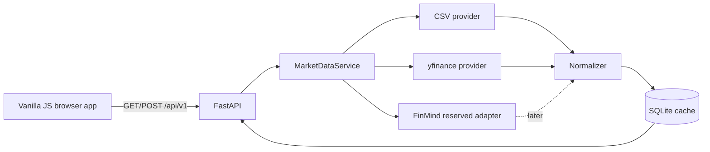

# Quant Strategy Agent Lab

> A local-first quantitative strategy research workbench built with Python, FastAPI, SQLite, and modular Vanilla JavaScript.


## Current status

**Phase 1 — Market Data Layer is implemented.** The application now provides:

- a provider-neutral market-data boundary;
- deterministic offline CSV fixtures for `AAPL`, `SPY`, and `QQQ`;
- optional daily-history synchronization through `yfinance`;
- a reserved FinMind adapter boundary for later Taiwan-market integration;
- OHLCV normalization, ordering, de-duplication, validation, and typed warnings;
- SQLite persistence for symbols, bars, source metadata, and synchronization audit records;
- versioned Market Data APIs;
- a framework-free Market Data Lab with symbol selection, date filters, provider sync, data provenance, quality warnings, an SVG close-price preview, and an OHLCV table;
- Linux bootstrap, development, testing, linting, formatting, build, and container workflows.

The implementation follows the project roadmap: Phase 1 establishes trustworthy, inspectable market data before Phase 2 adds technical indicators.

## Product vision

A user will define a strategy through a template or natural language. The system will convert it into a validated Strategy JSON DSL, build indicators, generate signals, run historical simulations, analyze performance, explain risk, scan parameters, and export a reproducible research report.

```text
Market data and source lineage
            ↓
Validated indicators and Strategy JSON DSL
            ↓
Signals → backtest → performance metrics
            ↓
Agent timeline → risk explanation → report
```

## Important disclaimer

> **Educational and research use only.** Bundled CSV rows are deterministic synthetic fixtures, not observed market prices. Network-synchronized historical data may be delayed, incomplete, revised, or subject to provider terms. Historical results do not guarantee future performance. This application does not provide financial, investment, tax, or legal advice.

## Phase 1 architecture



Provider-specific rows never reach the frontend directly. They are converted into one internal daily-OHLCV schema, validated, stored with provenance, and only then exposed through the API.

## Technology stack

### Frontend

- semantic HTML and modular CSS;
- Vanilla JavaScript with ES modules;
- native DOM, Fetch API, AbortController, URLSearchParams, and SVG;
- Vite for development and production bundling;
- ESLint, Prettier, and Node's built-in test runner.

### Backend and data

- Python 3.11+;
- FastAPI, Uvicorn, and Pydantic Settings;
- pandas and NumPy at the provider/data boundary;
- `yfinance` as an optional public-history adapter;
- Python's `sqlite3` module for the Phase 1 cache;
- Pytest with coverage and Ruff.

## Requirements

- Linux or another Unix-like environment;
- Python 3.11 or newer;
- Node.js 20.19+ or 22.12+;
- npm;
- optional Docker Engine with Docker Compose.

## Quick start on Linux

```bash
./scripts/bootstrap.sh
./scripts/dev.sh
```

The bootstrap script creates `.venv`, installs pinned backend dependencies, copies `backend/.env.example` to `backend/.env` when needed, and runs `npm ci`.

Open:

- Frontend: `http://127.0.0.1:5173`
- Market Data Lab: `http://127.0.0.1:5173/#/market-data`
- Backend: `http://127.0.0.1:8000`
- Swagger UI: `http://127.0.0.1:8000/docs`
- ReDoc: `http://127.0.0.1:8000/redoc`
- OpenAPI JSON: `http://127.0.0.1:8000/api/v1/openapi.json`

Stop both development servers with `Ctrl+C`.

## Market Data API

| Method | Path | Purpose |
|---|---|---|
| `GET` | `/api/v1/market/providers` | List provider capabilities and status |
| `GET` | `/api/v1/market/symbols` | List the supported symbol catalog and cache range |
| `GET` | `/api/v1/market/ohlcv` | Read normalized daily OHLCV from SQLite |
| `POST` | `/api/v1/market/sync` | Fetch, normalize, persist, and audit provider data |
| `GET` | `/api/v1/system/info` | Read current phase and cache statistics |
| `GET` | `/api/v1/health` | Liveness check |
| `GET` | `/api/v1/ready` | API/database readiness check |

### Read cached OHLCV

```bash
curl 'http://127.0.0.1:8000/api/v1/market/ohlcv?symbol=AAPL&start=2023-01-03&end=2023-01-09'
```

Every response identifies its provider, dataset, timezone, currency, adjustment policy, retrieval timestamp, fixture status, effective range, and data-quality warnings.

### Synchronize with fallback

```bash
curl -X POST 'http://127.0.0.1:8000/api/v1/market/sync' \
  -H 'Content-Type: application/json' \
  -d '{
    "symbols": ["SPY"],
    "provider": "auto",
    "start": "2023-01-03",
    "end": "2023-01-31",
    "allow_fallback": true
  }'
```

`provider: "auto"` tries `yfinance` first and then the bundled CSV provider. The response records every attempt and whether fallback occurred. Setting `allow_fallback` to `false` makes provider failure explicit.

## Offline fixture policy

The repository includes **synthetic**, deterministic weekday OHLCV for three demo assets from `2023-01-03` through `2025-12-31`:

```text
backend/data/seed/AAPL.csv
backend/data/seed/SPY.csv
backend/data/seed/QQQ.csv
```

These rows:

- are not observed historical prices;
- do not model exchange holidays;
- are marked `is_fixture_data = true` in storage and API responses;
- always produce a `synthetic_fixture_data` warning;
- exist so development, tests, and interviews work without network access.

Regenerate them deterministically with:

```bash
.venv/bin/python scripts/generate_demo_market_data.py
```

## Configuration

Backend settings use the `QSA_` prefix. See [`backend/.env.example`](backend/.env.example).

Important variables:

```text
QSA_MARKET_DATABASE_PATH
QSA_MARKET_CSV_SEED_DIR
QSA_MARKET_SEED_DEMO_DATA
QSA_MARKET_MAX_RESPONSE_BARS
QSA_MARKET_YFINANCE_ENABLED
QSA_MARKET_PROVIDER_TIMEOUT_SECONDS
QSA_FINMIND_TOKEN
```

Setting `QSA_MARKET_YFINANCE_ENABLED=false` forces deterministic offline operation. The FinMind token is accepted by configuration but the provider intentionally remains reserved in Phase 1.

## Quality gate

```bash
make check
```

The Phase 1 validation run executes:

1. Ruff lint and format checks;
2. 20 backend tests with a minimum coverage gate of 80%;
3. ESLint;
4. Prettier format verification;
5. 3 frontend unit tests;
6. a Vite production build.

See [`docs/PHASE_1_ACCEPTANCE.md`](docs/PHASE_1_ACCEPTANCE.md) for the recorded result.

## Docker Compose

```bash
docker compose up --build
```

The frontend is served at `http://localhost:8080`, Nginx proxies `/api` to FastAPI, and the SQLite cache is persisted in a named volume.

## Repository structure

```text
quant-strategy-agent-lab/
├── backend/
│   ├── app/
│   │   ├── api/               thin HTTP routes and error translation
│   │   ├── core/              settings, logging, dependency container
│   │   ├── domain/            provider-neutral market models and errors
│   │   ├── providers/         CSV, yfinance, reserved FinMind adapters
│   │   ├── repositories/      SQLite persistence
│   │   ├── schemas/           Pydantic request/response contracts
│   │   └── services/          normalization and market-data orchestration
│   ├── data/seed/             deterministic offline fixtures
│   └── tests/
├── frontend/
│   ├── src/
│   │   ├── charts/            native SVG adapters
│   │   ├── components/        reusable DOM components
│   │   ├── core/              router, store, API client, event bus
│   │   ├── layouts/           application shell
│   │   ├── pages/             route-level composition
│   │   ├── services/          API-facing use cases
│   │   ├── styles/            design tokens and responsive modules
│   │   └── utils/
│   └── tests/
├── docs/
├── scripts/
├── docker-compose.yml
├── Makefile
└── README.md
```

## Engineering rules

- Route handlers translate HTTP; business logic stays in services.
- Providers return source-domain rows; only the normalizer creates persistent bars.
- No market-data response may hide provider, adjustment, timezone, or fixture status.
- Startup seed import uses insert-if-missing semantics and must not overwrite synchronized rows.
- Pages may compose components and services; services never manipulate the DOM.
- No LLM will execute arbitrary generated Python. Later language parsing produces only validated Strategy JSON DSL.
- All backtests added later must record data lineage, costs, timing, parameters, and engine version.

## Documentation

- [Project specification](docs/PROJECT_SPEC.md)
- [Architecture](docs/ARCHITECTURE.md)
- [Market-data pipeline](docs/DATA_PIPELINE.md)
- [API specification](docs/API_SPEC.md)
- [Linux development guide](docs/DEVELOPMENT.md)
- [Strategy DSL](docs/STRATEGY_DSL.md)
- [Roadmap](docs/ROADMAP.md)
- [Phase 1 acceptance record](docs/PHASE_1_ACCEPTANCE.md)

## Next phase

**Phase 2 — Indicator Engine** will add tested SMA, EMA, RSI, MACD, Bollinger Bands, and ATR functions. Indicator results will be derived from the normalized cache rather than provider-specific payloads.
