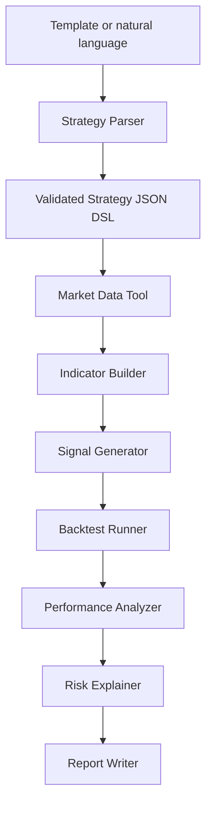

# Agent Workflow

> Status: workflow contract planned; the LLM parser arrives in Phase 9.

## Principle

The Agent coordinates deterministic tools. It does not become the calculation engine and does not execute arbitrary generated Python.



## Planned step states

```text
pending → running → success | warning | failed | cancelled
```

## Planned events

1. `strategy_received`
2. `strategy_parsed`
3. `strategy_validated`
4. `market_data_loaded`
5. `indicators_computed`
6. `signals_generated`
7. `backtest_executed`
8. `performance_analyzed`
9. `risk_explained`
10. `report_generated`

## Phase 1 contribution

The future `market_data_loaded` event can already report:

- symbol and interval;
- requested/effective ranges;
- providers and datasets;
- adjusted-price policy;
- fixture status;
- quality warnings;
- cache retrieval time.

This ensures Agent prose can cite concrete data assumptions instead of pretending the source is invisible.
