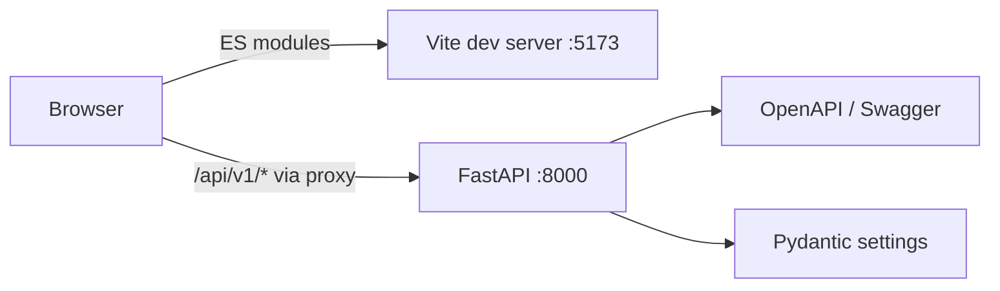
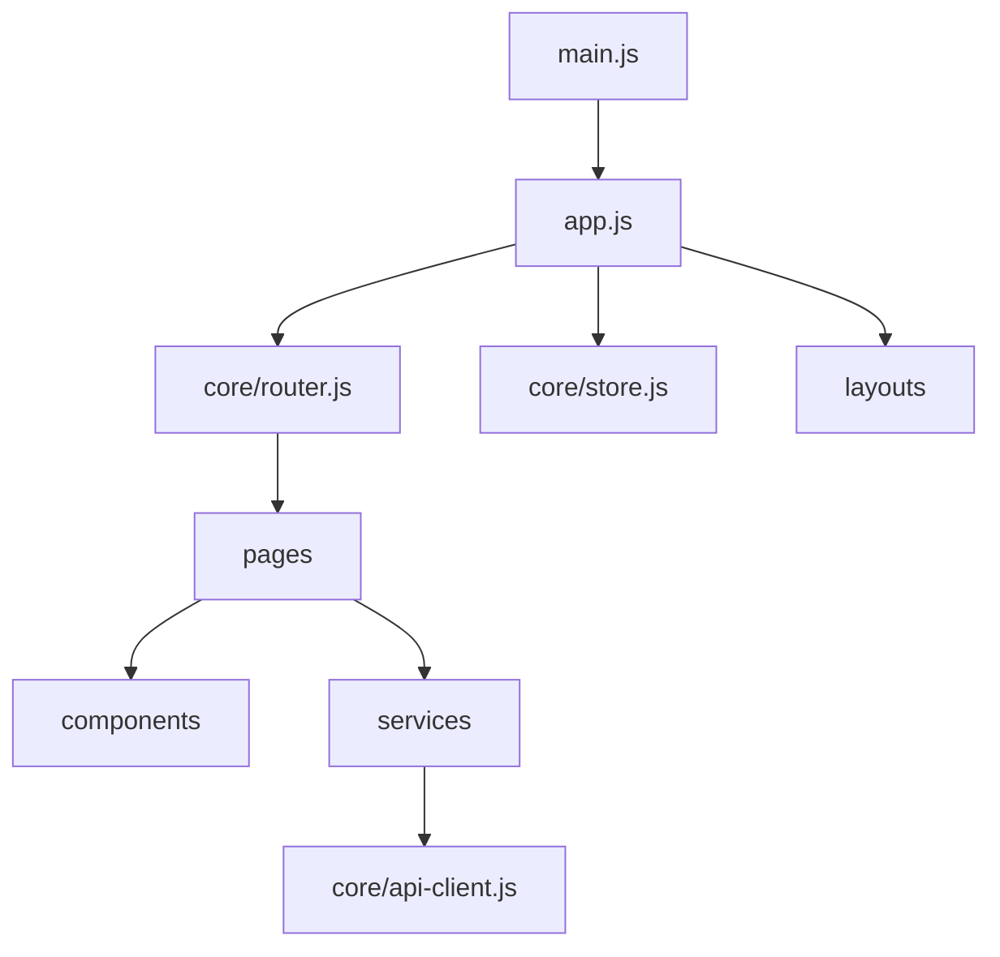
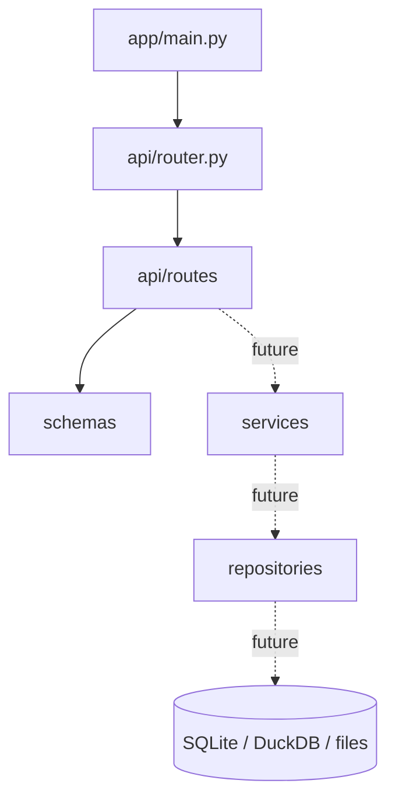
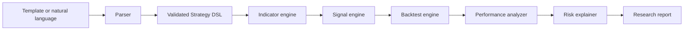

# Architecture

## 1. Phase 0 runtime architecture



The frontend development server proxies `/api` to FastAPI. That keeps browser requests same-origin during development while preserving a versioned backend contract.

## 2. Frontend dependency direction



Allowed direction:

```text
main → app → core/layout/routes → pages → components/services → API client
```

Forbidden examples:

- `core/` importing a page;
- a service manipulating DOM elements;
- a page embedding raw API URL construction;
- a chart library leaking throughout page code.

## 3. Backend dependency direction



Phase 0 has only metadata endpoints. Future financial logic will not be placed in route handlers.

## 4. Future quantitative pipeline



## 5. State ownership

The frontend store is for small cross-page application state, such as backend availability and the current draft strategy identifier. Large market series, chart instances, and transient form values should remain local to their owning page or component.

## 6. Error model

The API client converts network, timeout, and non-success HTTP responses into an `ApiError`. Pages decide how to render the error. Later backend phases will introduce a common error schema with a stable error code, human-readable message, details, and request identifier.

## 7. Versioning

All application endpoints begin under `/api/v1`. Static metadata stays at `/`, `/docs`, `/redoc`, and `/openapi.json`.
