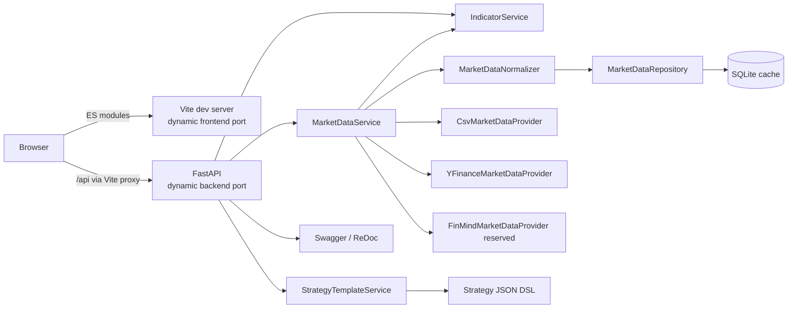
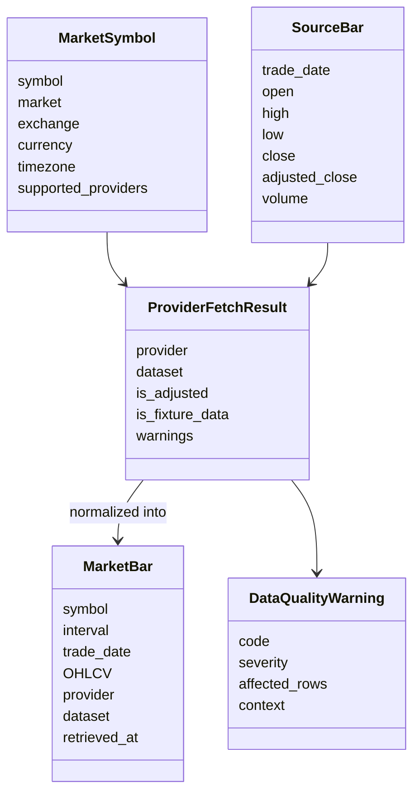
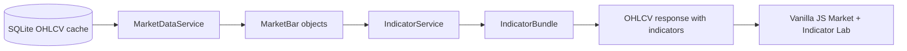
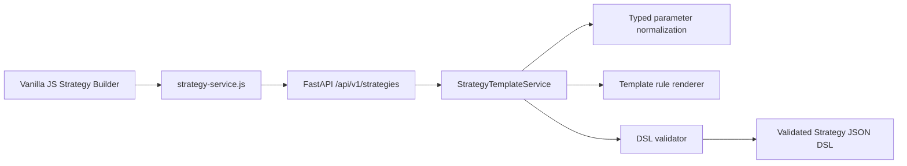
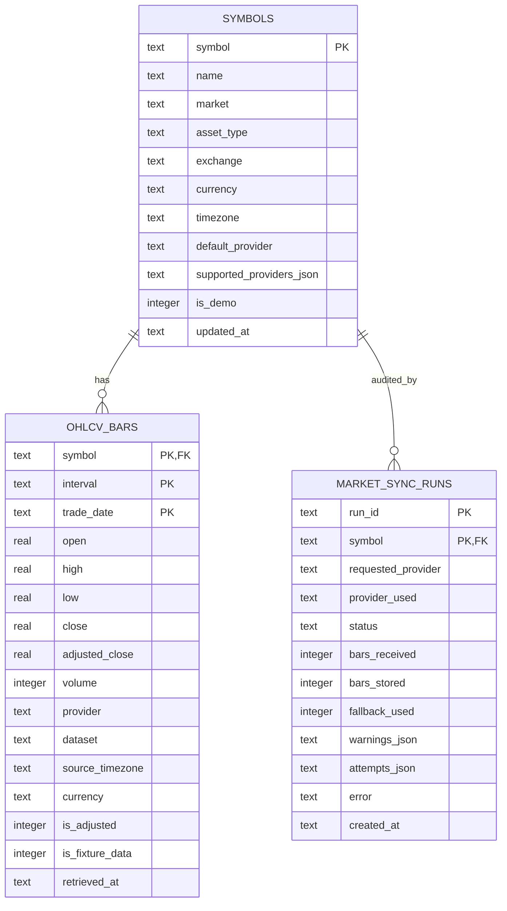

# Architecture — Phase 3

Phase 3 keeps the system intentionally layered: market data is normalized first, indicators are computed from normalized bars, and strategy templates render declarative Strategy JSON DSL documents for the future backtest engine.

## 1. Runtime topology

Development servers use dynamic ports selected by `./scripts/dev.sh` / `make dev`. Use the printed URLs instead of assuming fixed ports.



In production containers, Nginx serves the built frontend and proxies `/api`, `/docs`, and `/redoc` to the backend service.

## 2. Backend dependency direction

```text
main / lifespan
  → API routes and dependencies
    → Pydantic schemas
    → application services
      ├── market data service
      │   ├── provider adapters
      │   ├── normalizer
      │   └── repository → SQLite
      ├── indicator service
      │   └── provider-neutral MarketBar values
      └── strategy template service
          └── deterministic Strategy JSON DSL renderer
```

Rules:

- API routes translate HTTP input/output only; business rules live in services.
- Provider adapters may understand provider payloads, but they do not write to SQLite.
- Only the normalizer creates persistent `MarketBar` rows.
- `IndicatorService` consumes normalized `MarketBar` values only.
- `StrategyTemplateService` does not fetch market data, compute indicators, or execute trades.
- Strategy templates output declarative JSON only; no Python, JavaScript, shell, SQL, or file paths are accepted.

## 3. Market-data domain



`SourceBar` is deliberately permissive because external data may be missing or malformed. `MarketBar` is strict and can only exist after validation.

## 4. Indicator layer



Rules:

- indicator points are aligned with the same bars returned by the OHLCV request;
- warm-up values are serialized as `null` instead of fabricated;
- indicator requests are optional so raw market inspection stays lightweight;
- provider-specific DataFrames never leak into the indicator engine.

## 5. Strategy template layer



Implemented templates:

| Template ID | Category | Role |
|---|---|---|
| `buy_and_hold` | baseline | passive benchmark contract |
| `ma_crossover` | trend following | SMA cross entry/exit |
| `ma_crossover_rsi` | trend following | SMA cross plus RSI filter |
| `rsi_mean_reversion` | mean reversion | oversold/recovery RSI rules |
| `macd_trend_following` | trend following | MACD signal crossover rules |

The strategy layer is the controlled boundary for Phase 4. A backtest runner will consume the DSL; it will not parse random prose or execute arbitrary generated code.

## 6. SQLite model



The bar primary key is `(symbol, interval, trade_date)`. External synchronization uses upsert semantics. Startup fixture import uses insert-if-missing semantics, so restarting the application does not overwrite synchronized rows with synthetic data.

## 7. Frontend dependency direction

```text
main → app → router/layout/store
             ↓
           pages
        ↙         ↘
 components      services
     ↓              ↓
 chart/preview    API client
```

The global store stays small: route and backend availability. Market series, indicator previews, selected strategy template, typed parameters, validation reports, and rendered JSON are route-local state.

## 8. Failure behavior

- network provider failure does not corrupt the existing cache;
- fallback occurs only when the request enables it;
- unsupported symbols and invalid ranges produce typed domain errors;
- fixture data is always labeled in storage and API output;
- invalid template parameters return structured validation errors;
- DSL validation reports path-specific issues;
- cached read endpoints never silently call the network;
- the Strategy Builder never fabricates a strategy locally when backend rendering fails.

## 9. Phase boundaries

- Phase 1: validated daily OHLCV and provider lineage.
- Phase 2: tested technical indicators from normalized bars.
- Phase 3: deterministic templates render validated Strategy JSON DSL.
- Phase 4: signal generation and backtest execution from the DSL.
