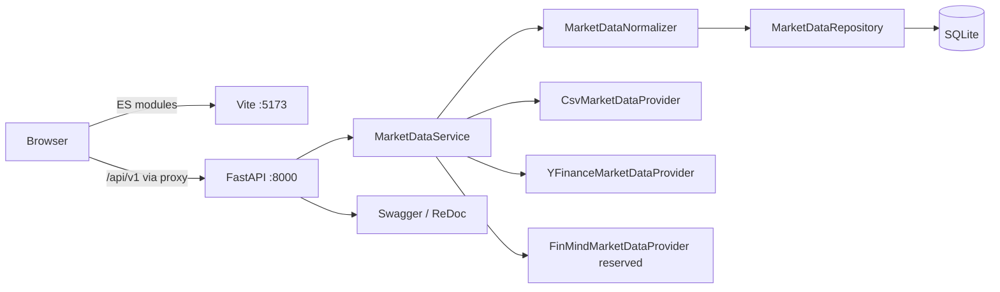
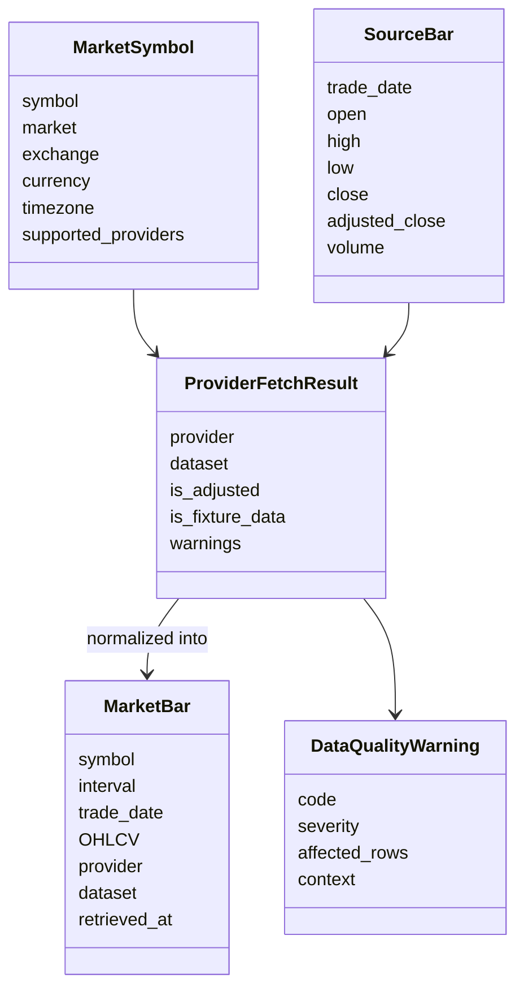
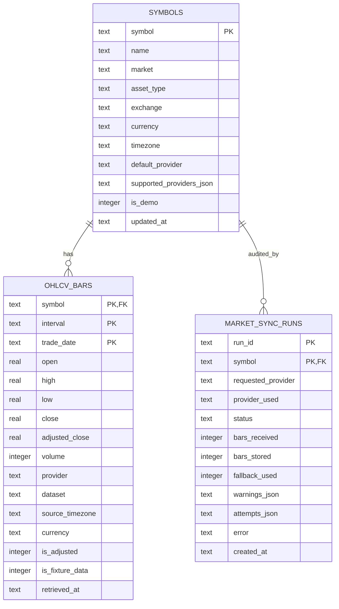
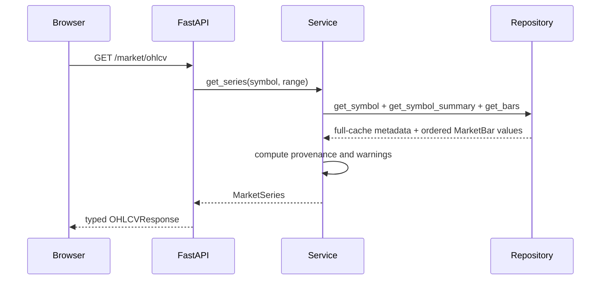
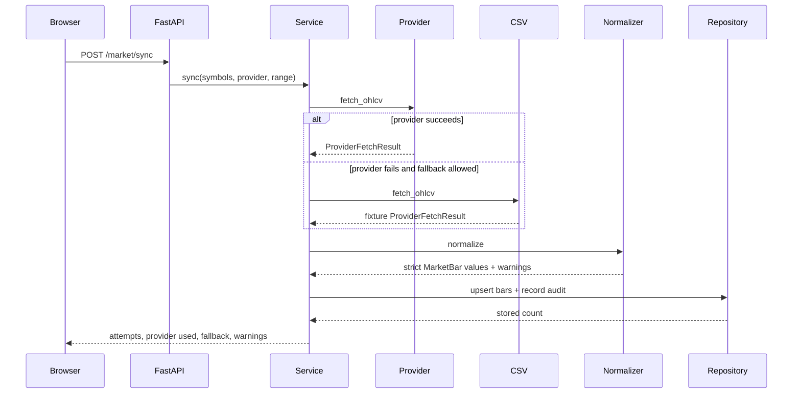

# Architecture — Phase 1

## 1. Runtime topology



In production containers, Nginx serves the frontend and proxies `/api` to the backend service.

## 2. Backend dependency direction

```text
main / lifespan
  → API routes and dependencies
    → Pydantic schemas
    → application service
      → provider protocol + provider adapters
      → normalizer
      → repository
        → SQLite
```

Rules:

- API routes may translate HTTP parameters and domain objects, but do not fetch or normalize data themselves.
- Provider adapters may understand provider payloads, but do not write to SQLite.
- Only the normalizer creates persistent `MarketBar` values.
- The service owns fallback order, use-case validation, audit outcomes, and response-level warnings.
- The repository owns SQL and row mapping; it does not call external providers.

## 3. Market-data domain



`SourceBar` is deliberately permissive because external data may be missing or malformed. `MarketBar` is strict and can only exist after validation.

## 4. Provider abstraction

All adapters implement the same conceptual contract:

```python
class MarketDataProvider(Protocol):
    name: ProviderName

    def list_symbols(self) -> tuple[MarketSymbol, ...]: ...

    def fetch_ohlcv(
        self,
        symbol: MarketSymbol,
        start: date | None = None,
        end: date | None = None,
    ) -> ProviderFetchResult: ...
```

Phase 1 adapters:

| Adapter | State | Role |
|---|---|---|
| CSV | implemented | deterministic offline fixture and fallback |
| yfinance | implemented | optional daily public-history synchronization |
| FinMind | reserved | preserves a clean future Taiwan-market boundary |

## 5. Normalization invariants

A row is persisted only when:

- date is within the requested range;
- open, high, low, close, and adjusted close are finite and positive;
- `high >= max(open, low, close)`;
- `low <= min(open, high, close)`;
- volume is finite and non-negative;
- duplicate dates have been reduced to one row;
- rows are sorted in ascending trading-date order.

Invalid and duplicate counts become typed `DataQualityWarning` values. If no valid rows remain, normalization fails instead of returning a deceptive empty success.

## 6. SQLite model



The bar primary key is `(symbol, interval, trade_date)`. External synchronization uses upsert semantics, so a newer provider row replaces the prior row for that date. Startup fixture import uses insert-if-missing semantics, so restarting the application does not overwrite synchronized rows with synthetic data.

## 7. Read and synchronization flows

### Cached read



### Provider synchronization



## 8. Frontend dependency direction

```text
main → app → router/layout/store
             ↓
           pages
        ↙         ↘
 components      services
     ↓              ↓
 chart adapter   API client
```

The Market Data page owns transient controls and loaded series. The global store remains limited to application-shell state such as route and backend availability. The chart is an adapter with `element` and `update()` rather than inline SVG logic scattered through the page.

## 9. Failure behavior

- Network provider failure does not corrupt the existing cache.
- Fallback occurs only when the request enables it, and is explicit in the sync response and audit table.
- A failed symbol does not abort the remaining symbols in a batch.
- Unsupported symbols and invalid ranges produce typed errors.
- Cached read endpoints never silently call the network.
- Fixture data is always labeled in both storage and API output.

## 10. Phase boundaries

Phase 1 provides validated daily OHLCV only. Phase 2 consumes `MarketBar` values to calculate indicators. Provider-specific DataFrames must not leak into the indicator engine.
