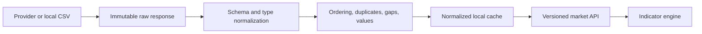

# Data Pipeline Design

## Status

Phase 1 will implement this pipeline. Phase 0 defines the contract and quality questions.

## Flow

## Separation of concerns

- **Raw:** provider-shaped response retained for debugging and provenance.
- **Normalized:** canonical date/time, numeric types, names, and ordering.
- **Validated:** warnings and fatal errors attached without silently altering meaning.
- **Derived:** indicators, returns, signals, and metrics stored separately from prices.

## Minimum provenance metadata

- provider and dataset name;
- fetch timestamp;
- requested and effective range;
- symbol and market;
- timezone and timeframe;
- adjusted/unadjusted status;
- row count;
- checksum or cache key;
- normalization version;
- warnings.

## Offline-first demo rule

A deterministic bundled CSV dataset will be the first provider implementation. Network providers will implement the same interface. This prevents an interview demo from becoming a live API outage simulator—a genre nobody asked for.
