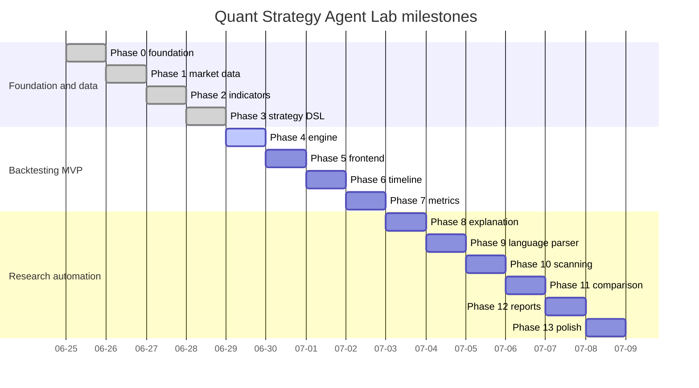

# Roadmap

## Status legend

- ✅ complete
- ▶ next
- ○ planned

| Phase | Status | Name | Exit condition |
|---:|:---:|---|---|
| 0 | ✅ | Foundation | Frontend/backend run, connect, document, test, lint, and build |
| 1 | ✅ | Market Data Layer | Validated OHLCV, provider fallback, SQLite cache, APIs, and data-inspection UI |
| 2 | ✅ | Indicator Engine | Tested SMA, EMA, RSI, MACD, Bollinger Bands, ATR, API bundle, and frontend SMA/RSI preview |
| 3 | ✅ | Strategy Template + DSL | Templates produce a fully validated Strategy JSON document |
| 4 | ▶ | Backtest Engine | One strategy produces deterministic trades, equity, and costs |
| 5 | ○ | Backtest Lab UI | Complete choose-configure-run-inspect workflow |
| 6 | ○ | Agent Timeline | Observable ordered workflow with success and failure states |
| 7 | ○ | Performance Analyzer | Documented and tested return/risk/trade metrics |
| 8 | ○ | Explanation Engine | Rule-based explanations before optional local LLM prose |
| 9 | ○ | Natural-language Parser | Supported sentences map safely to the DSL |
| 10 | ○ | Parameter Scanner | Sensitivity heatmap and ranked combinations with warnings |
| 11 | ○ | Multi-Asset Comparison | Same strategy compared across assets and benchmarks |
| 12 | ○ | Report Center | Markdown, JSON, and trade CSV exports are reproducible |
| 13 | ○ | Portfolio Polish | Complete docs, screenshots, tests, deployment, and demo script |

## Phase 2 completion record

### Backend

- provider-neutral `IndicatorService` built on normalized `MarketBar` rows;
- domain models for catalog items, indicator series, points, bundles, and warnings;
- SMA, EMA, RSI, MACD, Bollinger Bands, and ATR;
- explicit warm-up and null-value behavior;
- `/api/v1/indicators/catalog` endpoint;
- `/api/v1/market/ohlcv?include_indicators=true` response bundle;
- dynamic CORS origin regex for local development ports;
- optional yfinance dependency behavior remains explicit and recoverable.

### Frontend

- Market Data Lab upgraded into Market + Indicator Lab;
- `Include Phase 2 indicator bundle` checkbox;
- native SVG close + SMA 20 + SMA 60 overlay;
- native SVG RSI 14 oscillator with 70/30 guide lines;
- metric cards for indicator count and latest RSI;
- service contract updated for `include_indicators=true`.

### Developer workflow

- `./scripts/dev.sh` selects dynamic backend and frontend ports when not provided;
- dev output prints FastAPI, Swagger, ReDoc, Frontend, and Market Data Lab URLs;
- Vite `/api` proxy targets the dynamic backend port from the same dev run.

## Phase 3 completion record

### Backend

- `StrategyTemplateService` renders deterministic templates into Strategy JSON DSL;
- five MVP templates are available: Buy and Hold, MA Crossover, MA Crossover + RSI Filter, RSI Mean Reversion, and MACD Trend Following;
- `/api/v1/strategies/templates` lists typed template metadata;
- `/api/v1/strategies/templates/{template_id}/render` returns the backend-authoritative DSL preview;
- `/api/v1/strategies/validate` checks DSL structure, indicator ids, rule references, capital assumptions, and risk assumptions;
- template parameter errors use the same structured domain-error envelope as market-data errors.

### Frontend

- Strategy Builder route implemented at `/#/strategy-builder`;
- template cards, context controls, typed parameter editor, JSON preview, validation list, and metadata panels;
- all API calls go through `strategy-service.js`;
- no arbitrary code editor is exposed in Phase 3.

### Developer workflow

- `./scripts/dev.sh` prints the Strategy Builder URL using the selected dynamic frontend port;
- Vite proxy validation uses the printed frontend port, not a fixed port assumption.

## Phase 3 — Strategy Template + DSL

### Scope

- define Strategy JSON DSL validation models;
- implement Buy and Hold, MA Crossover, MA Crossover + RSI Filter, RSI Mean Reversion, and MACD Trend Following templates;
- map template parameters to indicator specs and rule conditions;
- add frontend Strategy Builder with JSON preview and validation messages;
- keep LLM parsing out of scope until the controlled DSL is stable.

### Exit condition

A user can select a strategy template, modify parameters, see a valid Strategy JSON document, and understand which indicator keys and rule operators will be used by the future backtest engine.

## Dependency order

Dates express dependency order, not delivery-time promises.
