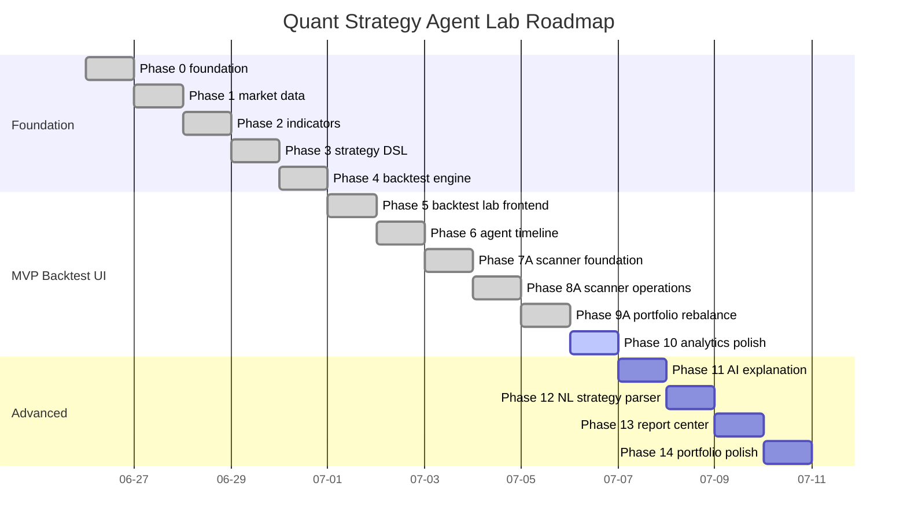

# Roadmap

The project is implemented phase by phase so each layer has a clear contract before the next one depends on it.

## Completed phases

### Phase 0 — Foundation

- FastAPI application shell;
- modular Vanilla JavaScript frontend shell;
- Linux bootstrap/dev/check scripts;
- README and technical documentation;
- baseline quality gates.

### Phase 1 — Market Data Layer

- provider-neutral market data domain;
- deterministic CSV fixtures for `AAPL`, `SPY`, and `QQQ`;
- SQLite OHLCV cache;
- yfinance adapter boundary;
- reserved FinMind adapter boundary;
- Market Data Lab.

### Phase 2 — Indicator Engine

- SMA;
- EMA;
- RSI;
- MACD;
- Bollinger Bands;
- ATR;
- indicator catalog;
- OHLCV endpoint indicator output;
- native SVG indicator previews.

### Phase 3 — Strategy Template System

- five deterministic MVP templates;
- Strategy JSON DSL v1.0;
- template rendering API;
- Strategy DSL validation;
- Vanilla JS Strategy Builder.

### Phase 4 — Backtest Engine MVP

- validated Strategy JSON DSL execution;
- feature frame and indicator computation from DSL requirements;
- entry/exit signal generation;
- deterministic long-only execution;
- next-open fills for normal signals;
- explicit commission and slippage;
- forced final-bar liquidation;
- trade ledger;
- equity curve;
- drawdown curve;
- basic performance metrics;
- warnings and Agent-style execution steps;
- minimal Vanilla JS Backtest Lab runner.

### Phase 5 — Backtest Lab Frontend

- candlestick chart with buy/sell markers;
- volume panel;
- richer metrics layout;
- better trade filtering and sorting;
- result persistence UI;
- dashboard polish.

### Phase 6 — Agent Timeline MVP

- formal Agent step model;
- expandable execution timeline;
- failure-state UI;
- backend step provenance for each run.

### Phase 7A — Market Universe and Scanner Foundation

- US common-stock universe refresh from Nasdaq Trader symbol directory files;
- cursor-based chunk synchronization for universe members;
- saved scanner runs and ranked result snapshots;
- Stock Scanner UI for cached-bar technical filtering.

### Phase 8A — Scanner Operations and Multi-Asset Backtest

- scanner presets and toggleable technical filters;
- sortable scanner result metrics and saved-run reload;
- skipped-symbol reason persistence;
- batch-sync history, missing/stale sync, and failed-symbol retry;
- universe data-quality report;
- scanner-driven multi-asset backtest ranking.

### Phase 9A — Portfolio Rebalance and Job Queue

- weekly/monthly equal-weight portfolio rebalance simulation;
- portfolio equity curve, turnover, holdings, skipped periods, and benchmark comparison;
- Performance Analyzer expansion with CAGR, annual volatility, Sortino, Calmar, rolling drawdown, and monthly returns;
- Scanner preset to Portfolio strategy workflow;
- SQLite-backed job queue for batch sync, scanner, and portfolio jobs;
- scanner and portfolio data-quality gates.

### Phase 9B — In-App Research Demo Automation

- 20-stock deterministic sample universe;
- one-click research demo workflow from sync to performance report;
- website auto-tour for Scanner, Jobs, Portfolio, Comparison, and Performance;
- Playwright validation for the in-app demo.

## Next phases

### Phase 10 — Portfolio Analytics Polish

- CSV/JSON exports;
- larger-scale async controls;
- richer benchmark and regime comparison;
- metric explanations and tooltips.

### Phase 8 — Rule-based / AI Explanation

- rule-based risk summary;
- optional local LLM explanation layer;
- Markdown strategy report.

### Phase 9 — Natural Language Strategy Parser

- natural language to Strategy JSON DSL;
- strict validation;
- no arbitrary Python generation.

### Phase 10 — Parameter Scanner

- parameter grid execution;
- heatmap output;
- strategy ranking table.

### Phase 11 — Multi-Asset Comparison Expansion

- risk/return scatter;
- benchmark-relative comparison;
- multi-run comparison history;

### Phase 12 — Report Center

- Markdown report export;
- JSON result export;
- trade CSV export.

### Phase 13 — Portfolio polish

- README refinement;
- screenshots;
- diagrams;
- final docs;
- demo script.

## Visual roadmap

