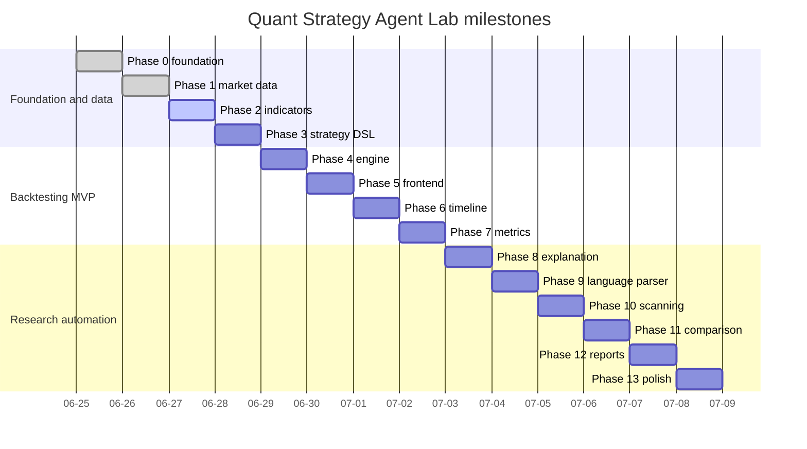

# Roadmap

## Status legend

- ✅ complete
- ▶ next
- ○ planned

| Phase | Status | Name | Exit condition |
|---:|:---:|---|---|
| 0 | ✅ | Foundation | Frontend/backend run, connect, document, test, lint, and build |
| 1 | ✅ | Market Data Layer | Validated OHLCV, provider fallback, SQLite cache, APIs, and data-inspection UI |
| 2 | ▶ | Indicator Engine | Tested SMA, EMA, RSI, MACD, Bollinger Bands, and ATR |
| 3 | ○ | Strategy Template + DSL | Templates produce a fully validated Strategy JSON document |
| 4 | ○ | Backtest Engine | One strategy produces deterministic trades, equity, and costs |
| 5 | ○ | Backtest Lab UI | Complete choose-configure-run-inspect workflow |
| 6 | ○ | Agent Timeline | Observable ordered workflow with success and failure states |
| 7 | ○ | Performance Analyzer | Documented and tested return/risk/trade metrics |
| 8 | ○ | Explanation Engine | Rule-based explanations before optional local LLM prose |
| 9 | ○ | Natural-language Parser | Supported sentences map safely to the DSL |
| 10 | ○ | Parameter Scanner | Sensitivity heatmap and ranked combinations with warnings |
| 11 | ○ | Multi-Asset Comparison | Same strategy compared across assets and benchmarks |
| 12 | ○ | Report Center | Markdown, JSON, and trade CSV exports are reproducible |
| 13 | ○ | Portfolio Polish | Complete docs, screenshots, tests, deployment, and demo script |

## Phase 1 completion record

### Backend and data

- provider protocol and source-neutral domain models;
- deterministic synthetic CSV provider;
- optional yfinance daily-history adapter;
- reserved FinMind adapter and configuration boundary;
- strict OHLCV normalization and typed quality warnings;
- SQLite symbol, bar, and synchronization-audit schema;
- startup seed import that does not overwrite synchronized rows;
- cache statistics and readiness checks;
- structured domain errors;
- symbols, providers, OHLCV, and sync APIs.

### Frontend

- Market Data route in the modular hash router;
- symbol selector and cached-range defaults;
- explicit synchronization provider and fallback controls;
- loading, success, warning, and error states;
- provenance and data-quality panels;
- native SVG close-price preview;
- newest-row OHLCV table;
- Phase 1 dashboard and navigation status.

### Validation

- 20 backend tests;
- 92.31% backend branch coverage in the acceptance run;
- 3 focused frontend unit tests;
- Ruff, ESLint, Prettier, and production build pass;
- live FastAPI/Vite smoke test;
- Vite `/api` proxy verified;
- fallback behavior verified with the optional network provider disabled by configuration;
- no development-server process left after shutdown.

## Phase 2 — Indicator Engine

### Scope

- add pure, typed functions for SMA, EMA, RSI, MACD, Bollinger Bands, and ATR;
- define warm-up and missing-value behavior;
- calculate indicators from normalized cached bars only;
- expose an indicator query contract without mutating raw bars;
- add property/example tests against hand-calculated fixtures;
- add frontend overlays/previews for at least SMA and RSI.

### Quality questions

- Is each formula documented?
- Does every indicator define its warm-up period?
- Are adjusted or raw prices used explicitly?
- Are results aligned to the original bar dates without look-ahead?
- Can indicator output be reproduced from the same cache and parameters?

### Phase 2 exit condition

A user can request supported indicators for a cached daily series, receive date-aligned values and metadata, and inspect at least SMA and RSI in the frontend. Every implementation has deterministic tests and documented warm-up semantics.

## Dependency order

Dates express dependency order, not delivery-time promises.
