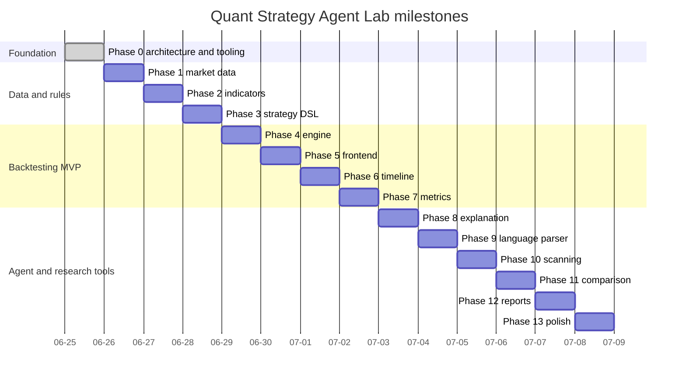

# Roadmap

## Status legend

- ✅ complete
- ▶ next
- ○ planned

| Phase | Status | Name | Exit condition |
|---:|:---:|---|---|
| 0 | ✅ | Foundation | Frontend/backend run, connect, document, test, lint, and build |
| 1 | ▶ | Market Data Layer | Validated OHLCV from provider plus local fallback and cache |
| 2 | ○ | Indicator Engine | Tested SMA, EMA, RSI, MACD, Bollinger Bands, and ATR |
| 3 | ○ | Strategy Template + DSL | Templates produce a fully validated Strategy JSON document |
| 4 | ○ | Backtest Engine | One strategy produces deterministic trades, equity, and costs |
| 5 | ○ | Backtest Lab UI | Complete choose-configure-run-inspect workflow |
| 6 | ○ | Agent Timeline | Observable ordered workflow with success and failure states |
| 7 | ○ | Performance Analyzer | Documented and tested return/risk/trade metrics |
| 8 | ○ | Explanation Engine | Rule-based explanations before optional local LLM prose |
| 9 | ○ | Natural-language Parser | Supported sentences map safely to the DSL |
| 10 | ○ | Parameter Scanner | Sensitivity heatmap and ranked combinations with warnings |
| 11 | ○ | Multi-Asset Comparison | Same strategy compared across assets and benchmarks |
| 12 | ○ | Report Center | Markdown, JSON, and trade CSV exports are reproducible |
| 13 | ○ | Portfolio Polish | Complete docs, screenshots, tests, deployment, and demo script |

## Phase 0 completion record

### Implemented

- modular Vanilla JavaScript shell and hash router;
- small observable store and API client;
- responsive dashboard and planned-feature pages;
- FastAPI application factory, settings, CORS, and API versioning;
- health and system metadata endpoints;
- Swagger UI, ReDoc, and OpenAPI schema;
- backend and frontend unit tests;
- Ruff, ESLint, Vite production build, and one-command quality gate;
- Linux bootstrap and dual-server development scripts;
- Dockerfiles, Nginx API proxy, and Compose definition;
- product, architecture, API, development, decision, and roadmap docs.

### Deliberately deferred

- external market-provider calls;
- databases and data migrations;
- financial indicators;
- strategy execution;
- backtest metrics and charts;
- LLM integration.

## Phase 1 — Market Data Layer

### Scope

- define `Symbol`, `OHLCVBar`, `DataSource`, and `DataQualityWarning` schemas;
- introduce provider interface and a deterministic CSV provider first;
- add one public-data provider behind the same interface;
- normalize timestamps, numeric types, ordering, duplicate rows, and missing values;
- cache normalized series locally;
- expose symbol, OHLCV, and synchronization endpoints;
- show a real symbol selector and raw data preview in the frontend.

### Quality questions

- Is the price adjusted or unadjusted?
- Are trading days and time zones explicit?
- How are splits, dividends, gaps, and duplicates handled?
- Can the demo still run without network access?
- Does every response reveal its source and effective date range?

### Phase 1 exit condition

A user can select a supported symbol, request a historical range, see validated OHLCV data and source metadata, and receive useful warnings for unsupported or poor-quality requests.

## Milestone grouping

Dates in the diagram express dependency order, not time promises.
